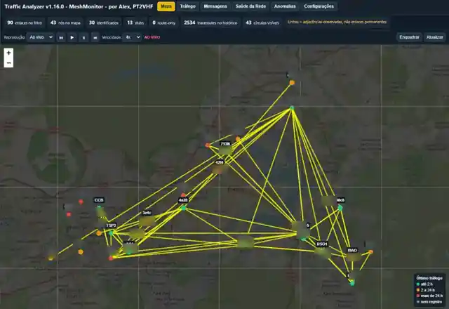
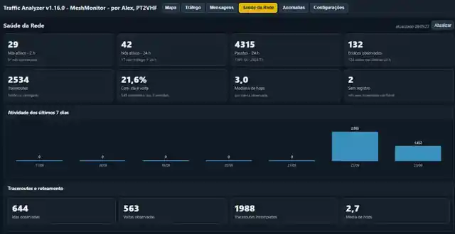

# Traffic Analyzer v1.57.1

**Traffic Analyzer** é uma aplicação complementar ao MeshMonitor para análise de topologia e tráfego Meshtastic. Ela usa a API v1 do MeshMonitor como fonte de dados, não disputa a conexão serial/TCP com o rádio e mantém um histórico próprio para relatórios.

## Novidades da v1.57.1

- Refina a correção do Ranking RF para preservar a consistência com o mapa **sem reintroduzir falsos enlaces diretos**.
- Hops RF com SNR válido continuam elegíveis mesmo quando o traceroute histórico já caducou.
- Quando o histórico autenticado do próprio par demonstra explicitamente que A e B estavam separados por intermediários, o par recebe **evidência negativa de multi-hop** e fica fora do Ranking.
- Resposta vazia do histórico não é tratada como prova contra o enlace: nesse caso permanece válida a evidência RF observada no hop.
- A auditoria passa a indicar **Multi-hop confirmado pela API** para exclusões dessa natureza.

## Novidades da v1.57.0

- **Ranking RF alinhado ao mapa:** o Top 10 passa a usar a mesma classificação **RF confirmado** exibida nos enlaces do mapa.
- Cada registro de `topology_edge_events` já representa uma adjacência/hop; se o hop tem `transport='rf'` e **SNR válido**, ele é elegível para o ranking quando os dois extremos possuem posição válida.
- O histórico da API `/traceroutes` continua sendo usado e identificado como evidência forte quando disponível, mas **deixa de ser requisito** para manter um hop RF histórico no ranking.
- Isso corrige casos como **Perseverance ↔ PT2TSP-3 - Águas Claras**, que possuíam observações RF/SNR no mapa, mas ficavam fora do Top 10 porque o traceroute original já não estava disponível.
- A interface identifica a origem da evidência como **RF observado no hop**, **API traceroute** ou **RF observado + API traceroute**.
- A auditoria do Ranking usa exatamente o mesmo critério do mapa, evitando que uma tela classifique o enlace como RF confirmado e outra o descarte.

## Novidades da v1.56.0

- **Cor dos nós corrigida:** verde/amarelo/vermelho passam a refletir somente tráfego realmente originado pelo nó (`/api/archive/nodes`) e `lastHeard`; `lastSeenMs` da topologia deixa de renovar artificialmente a atividade.
- Atualizações de NodeInfo, posição, status, backfill ou regeneração da topologia não tornam um nó antigo verde.
- **Ranking RF reconciliado por par:** todo enlace RF histórico conhecido, mas sem `route-adjacency-api`, é consultado individualmente pelo endpoint autenticado `/api/traceroutes/history/{a}/{b}`.
- A busca por par não depende do enlace ainda estar dentro do limite do backfill global e funciona para nós offline.
- Um par só é promovido se o histórico do MeshMonitor demonstrar que os dois nós são consecutivos em uma rota; SNR isolado continua insuficiente.
- Nova migração **`topology-direct-pair-reconcile-v5`** força a reconciliação nas instalações atualizadas.
- **Diagnóstico do Ranking:** Estatísticas → Ranking passa a listar enlaces RF excluídos e o motivo: sem evidência direta, sem posição válida ou simplesmente fora do Top 10.
- Mantidas todas as proteções contra falsos positivos como PT2PA ↔ PT2VHF-0.
- Fecha as issues **#51 e #52**.

## Novidades da v1.55.0

- **Corrige definitivamente o backfill histórico do Ranking RF.** A v1.54.0 usava `/api/analysis/traceroutes`, rota que não autentica o `MM_API_TOKEN` Bearer e podia retornar histórico vazio como usuário anônimo.
- O backfill passa a usar exclusivamente a API autenticada **`/api/v1/sources/{source}/traceroutes?limit=N`**.
- O `limit` cresce progressivamente, por padrão **5.000 → 10.000 → 20.000 → 40.000...**, até a API retornar menos registros que o solicitado.
- O teto de segurança padrão é 250.000 traceroutes e pode ser configurado por `TA_TRACEROUTE_HISTORY_MAX_LIMIT`.
- Uma nova migração **`topology-direct-history-v4`** força nova recuperação mesmo em instalações onde a v1.54.0 registrou incorretamente o backfill v3 como concluído.
- Enlaces históricos válidos de nós offline voltam a ser elegíveis no período **Todo**, usando a última posição válida conhecida.
- Evidências revalidadas continuam persistidas no `traffic.db` até reset explícito.
- Mantidas todas as proteções contra falsos positivos: pacotes brutos TX/RX, TTL e evidence kinds legados não promovem enlaces ao Ranking.
- Fecha a issue **#49**.

## Novidades da v1.54.0

- **Ranking RF histórico corrigido:** o período **Todo** volta a incluir enlaces diretos antigos e válidos, mesmo quando os nós estão offline atualmente.
- A recuperação inicial deixa de depender dos 5.000 traceroutes mais recentes da API v1.
- Quando disponível, o Traffic Analyzer usa **`/api/analysis/traceroutes` com paginação por cursor**, percorrendo todo o histórico do MeshMonitor.
- Cada traceroute histórico é revalidado pela mesma regra segura da v1.53.0: somente adjacências da API, SNR válido para RF e nenhuma inferência por pacote bruto/TTL.
- Evidências revalidadas são persistidas no `traffic.db` e permanecem elegíveis ao Ranking até reset explícito do banco.
- Nós offline continuam elegíveis usando a última posição válida conhecida preservada no histórico.
- Se a API paginada não existir em uma versão antiga do MeshMonitor, há fallback para a API v1 com limite alto configurável.
- O falso positivo PT2PA ↔ PT2VHF-0 continua protegido: nenhum pacote bruto ou evidência ambígua pode promovê-lo.
- Corrige também a Ajuda para apontar o Top 10 em **Estatísticas → Ranking**.
- Fecha a issue **#47**.

## Novidades da v1.53.0

- **Ranking RF corrigido novamente:** a v1.52.0 ainda podia promover evidência direta a partir de pacotes `TRACEROUTE_APP` brutos arquivados.
- **Pacotes brutos nunca promovem mais o Ranking.** Nem TX, nem RX, nem `hop_start/hop_limit` são usados como prova de enlace direto.
- A única fonte aceita para `direct_evidence` passa a ser o **endpoint `/traceroutes` do MeshMonitor**, que entrega os traceroutes orientados requester-first.
- `route` e `routeBack` são tratados corretamente como arrays de **nós intermediários**: `A + [B] + C` produz somente A↔B e B↔C.
- `route=[]` vindo da API de traceroutes representa uma perna sem intermediários e pode confirmar A↔C quando há SNR válido no hop.
- Na primeira execução da v1.53.0, todas as evidências diretas legadas da v1.52.0 são invalidadas automaticamente, **sem apagar eventos, nós, enlaces, SNR ou topologia**.
- O Ranking é reconstruído somente com snapshots confiáveis gerados pelo coletor v1.53.0.
- As linhas do Ranking agora expõem no tooltip os IDs de traceroute/pacote usados como auditoria.
- Fecha a issue **#45**.

## Novidades da v1.52.0

- **Ranking RF corrigido:** SNR válido deixa de ser suficiente para classificar um par como enlace direto.
- O **Top 10 enlaces RF diretos mais longos** passa a exigir evidência rastreável de **adjacência explícita** na rota ou confirmação independente de **zero saltos**.
- `route=[]`/rota vazia sem `hop_start == hop_limit` comprovado passa a ser tratada como **ambígua** e fica fora do Ranking.
- Rotas multihop continuam gerando apenas os pares adjacentes observados (A↔B, B↔C etc.), nunca um enlace ponta a ponta A↔C sem evidência direta.
- O banco histórico ganha `direct_evidence` e `direct_evidence_kind`, preservando a origem da comprovação (`route-adjacency` ou `zero-hop-packet`).
- Na primeira sincronização da v1.52.0, o sistema tenta recuperar evidências diretas antigas a partir dos `TRACEROUTE_APP` arquivados, sem apagar a topologia histórica.
- Registros antigos sem comprovação suficiente permanecem no histórico/topologia, mas são excluídos do Ranking.
- Fecha a issue **#43**.

## Novidades da v1.51.0

- **Estatísticas → Ranking:** nova subaba dedicada ao **Top 10 enlaces RF diretos mais longos**.
- O Top 10 deixa a subaba RF e mantém ordenação por distância, somente hops RF diretos confirmados e clique para isolar o enlace no mapa.
- **RF sem rolagem horizontal:** as tabelas do ranking e de enlaces observados passam a se ajustar à largura disponível.
- **Routing sem rolagem horizontal:** os blocos **Distribuição por hops** e **Nós intermediários observados** usam tabelas fluidas, permanecem lado a lado em desktop e empilham em telas menores.
- **Pontos de atenção:** a nomenclatura visível de Anomalias em Estatísticas foi substituída por **Pontos de atenção**, preservando algoritmo, severidades e filtros.
- **Subabas sempre acessíveis:** a barra superior de Estatísticas permanece sticky durante a rolagem; removidos os contêineres de rolagem internos que faziam a navegação desaparecer em conteúdos longos.
- Fecha as issues **#39, #40 e #41**.
- Atualiza manual, backlog e smoke tests para impedir regressões de layout e navegação.

## Novidades da v1.50.0

- **Backlog funcional fechado:** os itens de persistência, retenção, mapa, detalhes de nós, mensagens, consultas, estatísticas, atualização e distribuição passam a ter validação explícita no pipeline.
- **Consultas → Tudo:** as consultas ao nó são disparadas na mesma rodada com `Promise.allSettled`, sem aguardar resposta ou timeout de uma consulta para iniciar a seguinte. Cada consulta conserva progresso, correlação, resposta e timeout independentes.
- **Estatísticas → Acessos:** os controles específicos de Acessos passam para a mesma faixa do cabeçalho principal de Estatísticas; a segunda barra horizontal foi removida. Em telas menores os controles quebram de forma responsiva.
- **Relatório / PDF:** Estatísticas passa a gerar um relatório estruturado em nova janela, com resumo executivo, Top 10 RF direto, nós mais ativos, chat e anomalias, pronto para **Imprimir / Salvar como PDF** no navegador.
- **Exportar CSV:** Estatísticas passa a exportar diretamente o tráfego correspondente ao período e nó selecionados.
- Corrige a Ajuda da aba **Nós**, que ainda descrevia o comportamento antigo; clicar em uma linha abre a visualização ampliada de **Detalhes do nó**.
- Remove duplicações introduzidas no texto do manual PDF.
- Atualiza testes de regressão e o registro formal de backlog em `BACKLOG.md`.
- Fecha a issue **#37** sobre o cabeçalho de Estatísticas → Acessos.
- Preserva integralmente os recursos da v1.49.0.

## Novidades da v1.49.0

- **Estatísticas → RF:** o ranking dos enlaces RF diretos mais longos agora é interativo.
- Ao clicar em qualquer enlace do Top 10, a interface muda para **Mapa** e isola temporariamente somente os **dois nós** e o **enlace RF selecionado**.
- O mapa enquadra automaticamente o par selecionado.
- Durante o isolamento, os demais nós e enlaces ficam ocultos sem alterar ou apagar dados.
- Um botão **Mostrar todos os nós e enlaces** restaura imediatamente a topologia completa e os filtros/preferências anteriores continuam intactos.
- O modo isolado força apenas a visualização necessária do par selecionado, mesmo que filtros do mapa ocultassem aquele enlace/nós.
- O ranking continua considerando somente **hops RF diretos com SNR válido**, sem transformar rotas com intermediários em enlaces ponta a ponta.
- Suporte a clique, **Enter** e **Espaço** no ranking.
- Preserva todos os recursos da v1.48.0.

## Novidades da v1.48.0

- **Atualização automática permanente:** ao detectar uma nova Latest Release estável oficial, o Traffic Analyzer solicita a instalação automaticamente, sem depender de navegador aberto, login administrativo ou clique manual.
- O verificador roda em background respeitando o intervalo configurável atual e preserva lock, health check, rollback e backoff de falha.
- Depois que o backend muda de versão, páginas abertas passam a se recarregar automaticamente para usar a versão nova.
- O popup **Traffic Analyzer atualizado** continua exibindo as novidades e é controlado por navegador/perfil: cada navegador vê cada versão uma única vez.
- **Cores de idade dos nós corrigidas:** timestamps em segundos ou milissegundos são normalizados corretamente; também é usado o `lastSeenMs` histórico.
- Mantém verde até 2 h, amarelo/laranja entre 2 e 24 h, vermelho acima de 24 h e cinza quando não há timestamp confiável.
- Timestamps absurdamente futuros são ignorados em vez de fazer o nó parecer recém-ouvido.
- **Estatísticas → RF:** adiciona o ranking **10 enlaces RF diretos mais longos**, mostrando nós, IDs, distância, observações RF, SNR médio e última observação RF.
- O ranking considera somente hops físicos diretos com SNR válido; rotas com intermediários não viram enlaces ponta a ponta.
- O período selecionado em Estatísticas e o filtro por nó são respeitados.
- Preserva integralmente a memória histórica, retenção configurável e demais recursos da v1.47.1.

## Correção da v1.47.1

- Corrige a regressão da v1.47.0 em que **nós históricos sem posição conhecida** podiam causar `Invalid LatLng object: (undefined, undefined)` no Leaflet.
- Nós sem latitude/longitude válida continuam corretamente preservados na aba **Nós**, mas deixam de ser enviados ao renderizador do mapa.
- Nós com coordenadas válidas voltam a aparecer normalmente no mapa, sem afetar os enlaces persistentes.
- Aceita coordenadas numéricas ou strings numéricas válidas e rejeita valores ausentes, não finitos, fora da faixa geográfica ou Null Island.
- Adiciona teste de regressão no navegador para garantir que um nó histórico sem posição não interrompa os demais marcadores.
- Preserva integralmente a memória histórica e a retenção configurável introduzidas na v1.47.0.

## Novidades da v1.47.0

- **Memória permanente de nós:** uma vez observado, o nó permanece no `traffic.db` até o banco ser explicitamente apagado/resetado.
- **Última posição conhecida:** nós que deixam de aparecer no MeshMonitor continuam no inventário e, quando houver posição válida arquivada, permanecem mapeáveis com essa posição histórica.
- **Memória permanente de enlaces:** cada hop/enlace realmente observado é persistido independentemente da retenção futura do MeshMonitor ou do limite de traceroutes retornados pela API.
- **Janela = Todos** passa a usar os agregados históricos completos. As janelas de 1 h, 6 h, 12 h, 24 h, 7 dias e 30 dias apenas filtram a visualização e não apagam a memória.
- A classificação **RF × MQTT/não-RF** continua baseada em evidência real: somente observações com SNR válido são confirmadas como RF.
- Adiciona uma **fila durável de snapshots de topologia** para não perder observações caso o serviço web esteja temporariamente parado.
- Faz recuperação best-effort de enlaces antigos a partir de pacotes `TRACEROUTE_APP` já arquivados quando o metadata disponível permitir.
- **Configurações → Banco de tráfego:** nova retenção administrativa para pacotes/posições brutas com **1 dia, 1 semana, 1 mês ou Nunca apagar**.
- O padrão é **Nunca apagar**.
- A retenção do tráfego bruto é independente da memória de nós/enlaces: limpar pacotes antigos não remove nós e enlaces historicamente observados.
- Exibe quantidade de pacotes, nós históricos, enlaces históricos, registro bruto mais antigo e tamanho aproximado do banco.
- Preserva todos os recursos da v1.46.0.

## Novidades da v1.46.0

- **Bandeiras reais no idioma:** Português e English passam a usar SVG embutido no próprio aplicativo, evitando que Windows/Chrome mostrem apenas BR/US.
- Não há dependência de emoji, fonte externa ou CDN para as bandeiras.
- **Zoom mais gradual:** o mapa usa passos fracionários menores e uma roda do mouse/touchpad menos agressiva, reduzindo saltos entre enquadramentos.
- Os botões **+ / −** acompanham a mesma granularidade de zoom.
- **Estatísticas:** o período padrão passa a ser **Todo**, carregando o histórico completo na primeira abertura.
- Permanecem disponíveis os filtros de 1 h, 6 h, 24 h, 7 dias e 30 dias, além do filtro por nó.
- Preserva todos os recursos da v1.45.0.

## Novidades da v1.45.0

- **Cobertura RF em heatmap:** a camada deixa de desenhar círculos isolados e passa a compor um mapa de calor real com todas as recepções arquivadas do período.
- As recepções se acumulam visualmente; áreas com maior recorrência ficam mais quentes.
- A intensidade usa **SNR** quando disponível e **RSSI** como fallback, sem inventar medições.
- O detalhe de cada recepção continua acessível no mapa, mas os antigos círculos visíveis são substituídos por áreas de interação transparentes.
- A camada continua totalmente passiva: usa apenas dados já registrados e **não envia consultas extras pela malha**.
- A checagem automática de nova versão passa a ocorrer a cada **15 minutos por padrão**.
- Em **Configurações → Atualizações**, o administrador pode definir o intervalo entre **5 e 1.440 minutos**.
- O novo intervalo fica persistido no servidor e entra em vigor imediatamente, sem reiniciar o serviço.
- Clicar no indicador de versão continua fazendo uma verificação forçada e imediata.
- O seletor de idiomas com bandeiras e todas as funcionalidades da v1.44.0 permanecem preservados.

## Novidades da v1.44.0

- Adiciona **avisos automáticos no canal primário** da malha, com configuração administrativa separada.
- **INMET / Brasília-DF:** monitora os avisos meteorológicos oficiais e transmite apenas alertas novos ou atualizados que atinjam Brasília/DF.
- A detecção usa texto/área do aviso e, quando necessário, a geometria do polígono CAP para verificar interseção com o Distrito Federal.
- Na primeira inicialização, os alertas já ativos são apenas registrados como conhecidos, evitando flood de mensagens antigas.
- **Meshtastic:** monitora as Releases oficiais do firmware e anuncia novas versões **estáveis** e **instáveis** no canal primário.
- Prereleases e tags alpha/beta/RC/preview/nightly/dev são classificadas como instáveis.
- A primeira consulta do Meshtastic apenas registra as versões atuais; somente publicações posteriores são anunciadas.
- Cada envio é resumido para até aproximadamente **600 bytes** e reutiliza a integração existente com o MeshMonitor.
- Registra em `traffic.db` cada tentativa de aviso automático, com fonte, ID externo, tipo, horário, mensagem, resultado e detalhe técnico.
- Adiciona em **Configurações** controles separados para INMET, Meshtastic estável e Meshtastic instável, além de **Verificar agora**.
- Intervalo padrão de consulta: **10 minutos**.
- Preserva todos os recursos da v1.43.0.

## Versão completa v1.43.0

- Consolida em uma release única todos os recursos atuais do Traffic Analyzer.
- A camada antes chamada **Elevação mínima** passa a aparecer como **Relevo com corte**.
- Ao ativar **Mapa → Camadas → Relevo com corte**, surge no lado direito do mapa um **slider vertical** para definir a cota de corte em tempo real.
- O mapa destaca somente o terreno com altitude **igual ou superior** ao valor selecionado; o restante fica transparente.
- O topo da escala começa em **3.000 m** e pode ser alterado entre **100 e 9.000 m** pelo campo inferior do controle ou em **Configurações → Mapa e topologia**.
- O slider mantém **390 px** de altura em telas normais e **255 px** em telas menores.
- A camada possui **opacidade independente** e mantém nós, enlaces, animações e demais overlays visíveis acima dela.
- **Relevo sombreado** continua disponível separadamente para visualização de relevo sem corte por altitude.
- Preferências já salvas das versões anteriores continuam válidas.

## Correções da v1.42.1

- O **campo numérico inferior do controle de Elevação mínima** passa a definir o **limite máximo do range do slider**, em vez da cota mínima atual.
- O campo inferior aceita **100 a 9.000 m** e permanece sincronizado com o limite configurado em **Configurações → Mapa e topologia**.
- O valor da cota mínima continua sendo controlado pelo próprio slider e exibido numericamente no topo do controle.
- O limite máximo padrão continua em **3.000 m**.
- Se o novo limite máximo ficar abaixo da cota atual, a cota é ajustada automaticamente ao novo máximo.
- A altura do slider vertical aumenta **50%**: de **260 px para 390 px**.
- Em telas de menor altura, o slider aumenta de **170 px para 255 px**.
- O controle continua aparecendo somente quando a camada **Elevação mínima** está ligada.
- Preserva todos os recursos da v1.42.0.

## Novidades da v1.42.0

- Adiciona em **Configurações → Mapa e topologia** o campo **Limite superior da Elevação mínima**.
- O limite superior padrão passa a ser **3.000 m**.
- O máximo do slider vertical deixa de ser fixo e acompanha o valor configurado.
- A faixa configurável do limite superior é de **100 a 9.000 m**, preservando compatibilidade com o DEM global.
- Se a cota mínima atual ficar acima do novo limite, ela é reduzida automaticamente para o novo máximo.
- Aumenta a altura do slider vertical de **210 px para 260 px**; em telas mais baixas, de **135 px para 170 px**.
- Mantém o slider visível somente quando a camada **Elevação mínima** está ligada.
- O limite superior é salvo nas preferências locais e também pode fazer parte do padrão global do administrador.
- Corrige a inicialização de preferências antigas para respeitar o limite superior dinâmico.
- Preserva todos os recursos da v1.41.1.

## Correção da v1.41.1

- Ajusta o controle vertical da camada **Elevação mínima** para a faixa solicitada de **0 a 4.000 m**.
- O valor máximo exibido no topo da escala passa a ser **4.000 m** e o mínimo na base passa a ser **0 m**.
- O campo numérico de cota mínima também fica limitado a **0–4.000 m**.
- Reposiciona o controle para o **lado direito, centralizado verticalmente** no mapa.
- O slider aparece **somente quando a camada Elevação mínima está ligada** e desaparece imediatamente ao desligá-la.
- Mantém o último valor selecionado salvo nas preferências e restaura a cota ao reativar a camada.
- Preserva a camada **Relevo sombreado** de forma independente, sem exibir o slider quando apenas ela estiver ligada.
- Preserva todos os recursos da v1.41.0.

## Novidades da v1.41.0

- Nova camada **Elevação mínima** baseada em DEM real.
- Um **slider vertical** no mapa ajusta a cota mínima em tempo real: somente terrenos com altitude igual ou superior ao valor selecionado permanecem destacados.
- Faixa de ajuste de **-500 m a 9.000 m**, com passo de 50 m e campo numérico para ajuste fino.
- A camada possui **opacidade independente** e preserva nós, enlaces, animações e demais overlays acima dela.
- A ativação, altitude mínima e opacidade ficam salvas nas preferências locais e podem compor o padrão global definido pelo administrador.
- Os tiles de elevação são obtidos pelo backend a partir do dataset global Terrain Tiles em formato Terrarium.

## Novidades da v1.40.0

- Amplia **Mapa → Camadas** com **Cobertura RF, Relevo sombreado, Raios, Alertas meteorológicos e Nuvens**, além do Radar já existente.
- **Cobertura RF** usa exclusivamente posições já arquivadas pelo Traffic Analyzer que possuam SNR e/ou RSSI, sem transmitir pacotes extras. O período acompanha o filtro do mapa.
- A cobertura RF colore cada recepção pela qualidade observada e mostra nó, SNR, RSSI e horário no clique.
- **Relevo sombreado** usa o serviço World Hillshade da Esri como overlay independente, com transparência para manter nós e enlaces visíveis.
- **Alertas meteorológicos** consultam o feed público do INMET e desenham os polígonos CAP quando fornecidos, com evento, severidade, validade e descrição no popup.
- **Raios** usa integração opcional com Lightning API, limitada à área atualmente visível do mapa e aos últimos 60 minutos. A chave fica somente no servidor em `TA_LIGHTNING_API_KEY`.
- **Nuvens** usa integração opcional com Rainbow Weather Tiles. A chave fica somente no servidor em `TA_RAINBOW_API_TOKEN`, e os tiles são servidos por proxy para não expor o token ao navegador.
- Radar continua **ligado por padrão**. As cinco novas camadas iniciam desligadas.
- O estado de todas as camadas é salvo nas preferências locais e pode fazer parte do padrão global do administrador.
- Falhas de um provedor externo não derrubam o mapa nem a topologia; o menu mostra o estado individual da camada.
- Preserva todos os recursos da v1.39.0.

### Provedores opcionais das novas camadas

No arquivo `/etc/traffic-analyzer-map.env`:

```bash
TA_RAINBOW_API_TOKEN=
TA_LIGHTNING_API_KEY=
TA_INMET_ALERTS_URL=https://apiprevmet3.inmet.gov.br/avisos/ativos
```

**Cobertura RF** e **Relevo sombreado** não exigem chave. **Alertas INMET** usam o feed público configurado acima. **Raios** e **Nuvens** ficam disponíveis assim que as respectivas chaves forem configuradas e o serviço web reiniciado.

## Novidades da v1.39.0

- Adiciona um seletor **Mapa** diretamente na barra do mapa, ao lado de **Enquadrar** e **Atualizar**.
- Permite trocar imediatamente entre **OSM/Ruas, Topográfico, Claro, Escuro e Satélite** sem abrir Configurações.
- Mantém o seletor da barra sincronizado com **Configurações → Mapa e topologia**.
- Adiciona o menu expansível **Camadas** na barra do mapa.
- Inclui a camada **Radar meteorológico**, ligada por padrão.
- O radar usa o quadro de precipitação mais recente disponibilizado pelo RainViewer e é atualizado automaticamente a cada 5 minutos.
- O radar funciona como sobreposição independente do mapa-base e pode ser ligado/desligado a qualquer momento.
- A escolha do mapa-base e o estado da camada de radar são persistidos nas preferências visuais do navegador e podem fazer parte do padrão global salvo pelo administrador.
- Se o radar estiver temporariamente indisponível, o mapa e a topologia continuam funcionando normalmente e o menu informa a indisponibilidade da camada.
- Preserva todos os recursos da v1.38.0.

## Novidades da v1.38.0

- **RF × MQTT/não-RF:** um enlace só é confirmado como RF quando o hop possui evidência física válida de sinal, atualmente **SNR válido**. Na ausência dessa evidência, a observação é classificada como MQTT/não-RF.
- A nova regra corrige falsos enlaces RF causados por traceroutes recebidos pelo MeshMonitor por RF, mas cujos hops intermediários não possuem evidência RF própria.
- Enlaces mistos continuam preservando separadamente a quantidade de observações RF e MQTT/não-RF no período selecionado.
- O popup do enlace passa a mostrar a **distância em linha reta entre as duas estações**, em quilômetros, quando ambas possuem posição válida.
- Na aba **Nós**, clicar em um nó abre uma visualização ampla com as mesmas informações e consultas disponíveis no mapa, sem obrigar a troca para a aba Mapa.
- Na aba **Mensagens**, o nome do nó remetente passa a ser clicável e abre a mesma visualização de informações do nó.
- Amplia o modal de detalhes de nós para melhor aproveitamento da tela.
- Adiciona testes de regressão para impedir que um hop sem SNR válido volte a ser classificado como RF apenas por causa do transporte do traceroute.
- Preserva todos os recursos da v1.37.1.

## Correção da v1.37.1

- Corrige o indicador de versão que podia exibir **ATUALIZADO** por até 1 hora após a publicação de uma nova release.
- A consulta inicial ao GitHub agora é forçada ao abrir a interface.
- O cache interno da versão publicada foi reduzido de 1 hora para 5 minutos.
- A verificação periódica passa a ocorrer a cada 5 minutos.
- As requisições à API do GitHub usam cabeçalhos de não-cache para evitar resposta intermediária desatualizada.
- Clicar no indicador continua forçando uma verificação imediata.
- Preserva todos os recursos da v1.37.0.

## Novidades da v1.37.0

- Consolida **Saúde da Rede**, **Anomalias** e **Acessos** em uma nova aba principal **Estatísticas**, reduzindo a quantidade de abas no cabeçalho sem remover funcionalidades.
- Adiciona navegação interna por **Visão Geral, Rede, RF, Routing, Tráfego, Consultas, Chat, Energia, Anomalias e Acessos**.
- A **Visão Geral** apresenta KPIs do período, nós ativos, volume RX/TX, mensagens, traceroutes, relações observadas, médias de SNR/RSSI e anomalias, além de um resumo textual automático do estado da rede.
- Adiciona filtro global de período (**1 h, 6 h, 24 h, 7 dias, 30 dias ou todo o histórico**) e filtro por nó para os painéis derivados do arquivo persistente.
- O painel **RF** mostra relações origem-destino mais ativas, SNR/RSSI médios e recorrência observada, sem confundir relação lógica com adjacência RF comprovada.
- O painel **Routing** adiciona distribuição por hops e ranking de relays observados, complementando os indicadores de traceroute já existentes.
- O painel **Tráfego** resume RX, TX, nós originadores e participação por tipo de pacote.
- O painel **Consultas** separa TX e RX observados de NodeInfo, Position, Telemetry, Traceroute e Routing; ACK, resposta efetiva, timeout e indisponibilidade continuam tratados separadamente no diagnóstico do nó.
- O painel **Chat** reutiliza o ranking acumulado de interações do canal primário e acrescenta o volume de mensagens do período selecionado.
- O painel **Energia** consolida bateria, tensão, nós abaixo de 20%, nós abaixo de 10% e bateria média quando a telemetria estiver disponível.
- Os painéis usam o histórico SQLite, a topologia e as APIs já existentes; **não há migração de banco de dados** nesta versão.
- Atualiza os smoke tests de navegador e da release para validar a nova navegação e todas as subabas de Estatísticas.
- Preserva todos os recursos da v1.36.5.

## Novidades da v1.36.5

- Muda o backend preferencial das **consultas ativas** para o **Virtual Node do MeshMonitor** em `127.0.0.1:4404`, usando o cliente Python oficial Meshtastic.
- Mantém **mapa, histórico, nós, mensagens, estatísticas e Packet Monitor** lendo pela API do MeshMonitor; o **Traceroute** continua usando a API atual do MM, que já funciona corretamente.
- NodeInfo, Position, Device Metrics, Environment, Air Quality, Power e Neighbor Info passam a ser enviados no formato oficial: `wantResponse=true`, sem preencher `request_id` na requisição e sem `wantAck` forçado.
- Cada consulta retorna o `packet.id` original e só considera uma resposta confirmada quando o pacote RX traz `decoded.request_id == packet.id`.
- Telemetria periódica espontânea recebida depois do clique deixa de ser confundida com resposta à consulta.
- Respostas `ROUTING_APP` correlacionadas passam a encerrar a consulta imediatamente com o motivo real, incluindo `NO_RESPONSE`, `NO_ROUTE`, `NO_CHANNEL` e `NOT_AUTHORIZED`.
- No backend Virtual Node, o timeout padrão é **30 s**; o acompanhamento tardio continua disponível.
- Adiciona o helper `meshtastic_query.py` e instala o cliente `meshtastic[cli] 2.7.11` em um venv próprio em `/opt/traffic-analyzer/.venv`.
- O modo padrão `TA_NODE_QUERY_BACKEND=auto` prefere o Virtual Node. Se o helper não estiver disponível, usa fallback explícito para a API do MeshMonitor e informa isso no status.
- Novas opções: `TA_VIRTUAL_NODE_HOST`, `TA_VIRTUAL_NODE_PORT`, `TA_VIRTUAL_NODE_PYTHON`, `TA_VIRTUAL_NODE_HELPER` e `TA_VIRTUAL_NODE_CONNECT_TIMEOUT`.
- Preserva todos os recursos da v1.36.4.

## Novidades da v1.36.4

- Corrige o acompanhamento das consultas remotas depois de confirmar respostas de **Telemetry** chegando somente após dezenas de segundos.
- Consultas de Telemetria passam a usar janela de até **90 s**; NodeInfo, Position, Traceroute e Neighbor Info mantêm timeout curto de 20 s.
- Entre 20 e 90 s, a interface deixa de declarar falha prematuramente e informa a fase atual: sem resposta inicial, possível retry do MeshMonitor, retry 1 observado e retry 2 observado.
- O Traffic Analyzer passa a consultar também os pacotes **TX** do Packet Monitor destinados ao nó e identifica as retransmissões automáticas realmente emitidas pelo MeshMonitor.
- O botão **Tudo** permanece ativo enquanto houver consultas de Telemetria dentro da janela de recuperação, em vez de encerrar toda a rodada aos 20 s.
- Depois de um timeout, o popup continua observando respostas tardias por até **3 minutos**; se chegarem, o estado muda automaticamente para respondido e é marcado como resposta tardia.
- A evidência de roteamento passa a aceitar `ROUTING_APP` e exibir ACK/NAK apenas quando o Packet Monitor fornecer um `requestId` que possa ser correlacionado com segurança ao TX original.
- Mantém no resultado confirmado o tipo de pacote, canal, SNR e RSSI recebidos.
- Usa o source concreto do MeshMonitor também ao carregar os detalhes e pacotes do nó.
- Preserva o novo seletor de idiomas e todos os recursos da v1.36.3.

## Novidades da v1.36.3

- Substitui o seletor nativo de idioma por um **menu compacto com bandeiras**, seguindo o padrão visual solicitado.
- O botão superior mostra o idioma ativo com **bandeira, nome e seta de expansão**.
- O menu destaca visualmente o idioma selecionado e mantém **Português** e **English** como os idiomas atualmente suportados.
- Mantém a preferência de idioma salva no navegador e aplica a troca imediatamente, sem recarregar a página.
- Adiciona navegação por teclado, `aria-expanded`, `role=listbox`, `aria-selected` e foco visível para acessibilidade.
- Ajusta o seletor para os temas claro e escuro.
- Atualiza os smoke tests para validar abertura do menu, seleção de idioma, tradução da navegação e persistência do estado.
- Preserva todos os recursos e correções da v1.36.2.

## Novidades da v1.36.2

- Remove o **canal 0 forçado** das consultas NodeInfo e Posição; o próprio MeshMonitor 4.16.x volta a resolver o canal correto do nó conforme source e NodeDB.
- Quando `MM_SOURCE=default`, o Traffic Analyzer resolve e usa o **ID real da fonte primária** do MeshMonitor antes das consultas.
- Neighbor Info e Telemetria também usam explicitamente esse source real, reduzindo risco de envio pelo manager/source errado em ambientes multi-source.
- O canal efetivamente selecionado pelo MeshMonitor passa a ser extraído da resposta da API e mostrado no status da consulta.
- O intervalo entre consultas do botão **Tudo** sobe de 700 ms para **2 s**, reduzindo colisões entre requests/respostas sem voltar ao comportamento bloqueante.
- O timeout individual passa de 15 s para **20 s**.
- A detecção de respostas inclui detalhes do Packet Monitor quando disponíveis: portnum, canal, SNR e RSSI.
- Mantém respostas tardias: uma consulta marcada como timeout pode mudar para **respondida** caso o pacote chegue depois.
- Continua distinguindo **MM aceitou o TX** de **nenhuma resposta RX**.
- Preserva todos os demais recursos da v1.36.1.

## Novidades da v1.36.1

- Corrige o caminho de envio das consultas **Informações do nó, Posição, Vizinhos e Telemetria** para usar os endpoints source-aware do MeshMonitor 4.16.x.
- As consultas de NodeInfo e Posição passam a usar explicitamente o **canal primário (0)** e o source configurado no Traffic Analyzer.
- Telemetria e Neighbor Info passam a enviar explicitamente o **sourceId**, evitando que a consulta seja resolvida pelo source errado em instalações com múltiplas fontes.
- O instante da consulta passa a ser registrado **antes** da chamada HTTP ao MeshMonitor, evitando perder respostas de nós muito próximos que chegam antes do retorno da API.
- Cada consulta mostra quando o **MeshMonitor aceitou o envio**, incluindo canal e packet ID quando disponíveis; se não houver retorno, o status diferencia aceitação do TX de ausência de RX.
- Mantida a detecção independente das respostas de NodeInfo, Position, Device, Environment, Air Quality, Power, Neighbor Info e Traceroute.
- Ao usar **Expandir**, a janela do nó passa a ocupar praticamente **toda a viewport do navegador**, cobrindo também as barras superiores da aplicação e deixando apenas pequena margem.
- **Restaurar** retorna a janela para a posição e dimensões anteriores.
- Preserva todos os demais recursos da v1.36.0.

## Novidades da v1.36.0

- Substitui o popup de nó do Leaflet por uma **janela flutuante independente** sobre o mapa.
- A janela pode ser **arrastada livremente pelo cabeçalho**, sem mover o mapa.
- Adiciona **redimensionamento real** pelo canto inferior direito, permitindo ampliar e reduzir largura e altura.
- Inclui controles **Reposicionar**, **Expandir/Restaurar** e **Fechar** sempre visíveis no cabeçalho.
- O modo Expandir usa toda a área útil do mapa e o Restaurar volta ao tamanho e posição anteriores.
- A posição e o tamanho da janela são preservados durante atualizações de topologia e enquanto chegam respostas de NodeInfo, Position, Telemetry, Neighbor Info e Traceroute.
- O conteúdo passa a ter **rolagem interna própria**, sem limitar a janela ao comportamento do popup nativo do Leaflet.
- Ao clicar em outro nó do mapa, a mesma janela é reutilizada e atualizada, sem depender de reabrir popup ancorado ao marcador.
- Corrige a exibição de erro de **Neighbor Info**: respostas HTML/404 do MeshMonitor deixam de aparecer cruas e passam a ser mostradas como endpoint indisponível/não suportado.
- Mantém as consultas assíncronas, barras de progresso e a ordem de consultas introduzidas na v1.35.1.
- Preserva todos os demais recursos da v1.35.1.

## Novidades da v1.35.1

- O botão **Tudo** das consultas ao nó deixa de aguardar resposta/timeout de cada pergunta antes de enviar a próxima. As solicitações são disparadas em uma única rodada, com **700 ms de espaçamento** entre transmissões para evitar rajadas desnecessárias na malha.
- Cada consulta passa a ser acompanhada de forma **independente e assíncrona**. Uma pergunta sem resposta não bloqueia as demais e os resultados aparecem no popup à medida que chegam.
- O timeout interativo das consultas foi reduzido para **15 s** e cada linha ganhou **barra de progresso própria**, além do estado final respondido/timeout/erro/não aplicável.
- Respostas concluídas mostram também o **tempo de resposta**, facilitando diferenciar latência real de ausência de suporte.
- A detecção de Telemetry passa a respeitar o **subtipo efetivamente recebido**: Device, Environment, Air Quality e Power não são mais considerados respondidos apenas porque qualquer pacote `TELEMETRY_APP` chegou.
- A ordem das consultas no popup passa a ser **Informações do nó → Posição → Energia → Traceroute → Dispositivo → Ambiente → Qualidade do ar → Vizinhos → Tudo**.
- O popup de informações do nó passa a ser **redimensionável**, mantém o arraste já existente e ganha botão **Expandir/Restaurar** para ocupar a área útil do mapa quando houver muito conteúdo.
- O indicador de versão passa a fazer uma **checagem forçada ao ser clicado**. O popup mostra a versão instalada, a versão publicada e as melhorias/notas da Release, com acesso direto ao GitHub e botão **Fechar**.
- O popup de versão é aberto imediatamente ao clique, exibindo o estado de verificação enquanto a consulta ao GitHub é concluída, evitando a impressão de que o clique não funcionou.
- A verificação automática de nova versão passa a ocorrer **a cada 1 hora**, além da verificação feita na abertura da interface.
- Preserva todos os recursos da v1.34.0.

## Novidades da v1.34.0

- Refaz o acompanhamento das **consultas ao nó**: Node Info, Position e Telemetry passam a procurar uma resposta RX real do tipo correto no Packet Monitor do MeshMonitor, em vez de depender apenas da mudança do valor já salvo no NodeDB.
- O botão **Tudo** passa a executar as consultas de forma realmente **sequencial**: envia uma pergunta, aguarda resposta ou timeout de 30 s, aplica uma guarda de 4 s e só então transmite a próxima. O Traceroute continua por último.
- O botão Tudo exibe progresso `concluídas/total` durante a execução.
- **Neighbor Info** é marcado como não aplicável e não é transmitido para nós com mais de 0 hop, evitando o HTTP 403 conhecido do MeshMonitor.
- O check **✓ verde** só aparece após uma resposta nova observada; requisição aceita pelo servidor não é tratada como resposta.
- A seção **Últimos metadados recebidos** passa a manter somente a amostra mais recente de cada tipo, preservando o histórico completo no MeshMonitor/banco.
- Rótulos de consultas, estados e metadados do popup passam pelo mecanismo de idioma. Em Português, termos como Informações do nó, Posição, Métricas do dispositivo, Saltos da mensagem e SNR remoto deixam de aparecer em inglês.
- Percentuais continuam padronizados com uma casa decimal.
- O popup do nó fica mais largo em desktop, com limite de aproximadamente **1120 px**, botão **Fechar** destacado e botão **Reposicionar**.
- A posição arrastada do popup passa a ser preservada por coordenada de tela, inclusive quando a topologia é regenerada e o marcador/popup precisa ser reconstruído.
- Na aba **Nós**, a distância passa a usar explicitamente o **VHF3** como referência.
- A bateria na lista de nós recebe cor no próprio percentual: verde ≥ 50%, amarelo de 20% a 49,9% e vermelho < 20%.
- A aba Nós ganha filtro instantâneo caractere por caractere, pesquisando nome, short name, Node ID, hardware, role e demais campos disponíveis.
- Clicar em um nó na lista agora apenas leva ao **Mapa**, centraliza o marcador e aplica zoom mais próximo; o popup só abre se o usuário clicar no marcador.
- Nova aba **Acessos**, restrita ao administrador quando a autenticação está habilitada, com análise de acessos por dia, países, cidades, IPs, navegadores, sistemas operacionais, logins bem-sucedidos e falhas de login.
- Cada abertura da interface também é gravada em **`/var/lib/traffic-analyzer/access.log`**, por padrão no mesmo diretório do `traffic.db`, em formato JSON Lines.
- Os acessos também são indexados na tabela `web_access` do `traffic.db` para permitir estatísticas rápidas. A retenção padrão é 365 dias e o arquivo bruto gira ao atingir 20 MiB.
- País/cidade são obtidos de cabeçalhos confiáveis de proxy/CDN, endereços locais/privados ou de um endpoint GeoIP explicitamente configurado. **Nenhum IP público é enviado a serviço externo por padrão.**
- A aba Acessos permite baixar o `access.log` bruto.
- Preserva todos os recursos da v1.33.0.

## Novidades da v1.33.0

- O popup de informações do nó no mapa passa a ser **arrastável pela tela**.
- O cabeçalho do popup recebe uma alça visual de movimento; clique/toque e arraste para reposicionar a janela sem mover o mapa.
- O deslocamento é limitado à área visível do mapa para evitar que a janela seja perdida fora da tela.
- Quando o popup é movido para longe do marcador, a ponta de ancoragem é ocultada para deixá-lo com comportamento de janela flutuante.
- O popup fica acima da legenda e dos controles do mapa enquanto estiver aberto/arrastando, evitando sobreposição da legenda sobre as informações do nó.
- A **rolagem interna** continua independente do arraste: o conteúdo longo permanece rolável normalmente.
- A posição escolhida e a posição de rolagem são preservadas durante atualizações automáticas da topologia enquanto o mesmo nó continuar aberto.
- Ao fechar o popup ou abrir outro nó, a posição flutuante é reiniciada para uma abertura normal junto ao novo marcador.
- O modal de detalhes usado por nós sem marcador continua estático, sem comportamento de arraste.
- Inclui smoke test automatizado que abre um nó, arrasta o popup e confirma o deslocamento no navegador.
- Preserva todos os recursos da v1.32.0, incluindo a aba Nós, nomes amigáveis de hardware e percentuais com uma casa decimal.
## Novidades da v1.32.0

- Nova aba superior **Nós**, com inventário dos nós conhecidos pelo MeshMonitor.
- A tabela principal mostra **Nome longo, Nome curto, Role, Hardware, Saltos, Bateria, Tensão, Distância, SNR, Última interação e Última posição**.
- Colunas técnicas opcionais podem ser ativadas pelo menu **Colunas**: **RSSI, Utilização do canal, Air Util TX, Node ID, PKC e Estado**.
- Todos os títulos das colunas são clicáveis e alternam ordenação **crescente/decrescente**, com ordenação numérica real para saltos, bateria, distância, SNR e timestamps.
- **Última interação** usa tempo relativo compacto (`30 s`, `10 min`, `3 h`, `2 d`) e semáforo: **verde até 1 h**, **amarelo de mais de 1 h até 12 h** e **vermelho acima de 12 h**; sem timestamp fica neutro.
- A idade das interações é atualizada automaticamente enquanto a aba permanece aberta.
- A distância é calculada em linha reta a partir do **nó local da fonte MeshMonitor**, identificado pela API v1 de status da própria fonte.
- Clicar em um nó abre seu detalhe; quando ele possui marcador visível, o Traffic Analyzer leva ao mapa e abre o mesmo popup. Nós sem marcador podem ser consultados em um modal de detalhes.
- O popup do nó passa a exibir **nome amigável do hardware**, seguindo a enumeração HardwareModel utilizada pelo MeshMonitor/Meshtastic (por exemplo, `110 → Heltec V4`, `43 → Heltec V3`).
- Roles numéricas também passam a ser apresentadas por nome amigável.
- O popup aberto é **preservado durante as atualizações periódicas da topologia** e mantém sua posição de rolagem, evitando o fechamento automático observado nas versões anteriores.
- O checklist das consultas continua marcando **✓ verde somente quando uma resposta nova é efetivamente observada no MeshMonitor**; envio aceito sem resposta permanece aguardando.
- Todos os percentuais exibidos no popup, metadados e tabela de nós passam a usar **1 casa decimal**, respeitando vírgula em Português e ponto em English.
- Mantém todas as funções da v1.31.0, incluindo download direto da Latest Release pelo indicador superior.

## Novidades da v1.31.0

- O popup dos nós passa a usar um layout **mais largo, em paisagem**, aproveitando melhor a largura da tela.
- Os metadados são organizados em **duas duplas campo/valor por linha** em telas grandes, reduzindo bastante a altura total do popup.
- O checklist das consultas também passa a usar duas colunas no desktop, e a área de últimos metadados pode distribuir registros em duas colunas.
- O popup recebe **rolagem interna vertical** e limite de altura relativo à janela; quando o conteúdo exceder a tela, o mapa permanece parado e somente o popup rola.
- Em telas médias e pequenas o layout retorna automaticamente para uma coluna, mantendo a interface responsiva.
- A troca de idioma no cabeçalho passa a aparecer como um **único menu pull-down** compacto, mantendo 🇧🇷 Português e 🇺🇸 English e preservando a preferência no navegador.
- Quando existir uma **Latest Release estável mais recente**, o indicador de versão no topo passa a mostrar **BAIXAR**. Clicar nele inicia diretamente o download do ZIP versionado publicado naquela Release.
- O servidor identifica o asset exato `traffic-analyzer-vX.Y.Z.zip`, usando `traffic-analyzer-latest.zip` apenas como fallback da mesma Latest Release.
- Quando não houver atualização, clicar no indicador continua abrindo as informações da versão instalada.
- O `install.sh` agora **encerra de forma controlada a interface e o ciclo agendado da versão anterior antes de substituir os arquivos**, evitando atualização sobre uma instância em execução.
- Após a instalação, os serviços são habilitados novamente, a topologia é regenerada e a interface retorna normalmente.
- Configurações, token do MeshMonitor, autenticação, `traffic.db`, estado e demais dados persistentes continuam preservados.

## Novidades da v1.30.0

- O popup de cada nó passa a funcionar como um **painel completo de diagnóstico**, mostrando tanto as informações disponíveis quanto os campos ainda ausentes.
- Cada metadado esperado recebe um indicador visual: **✓** quando existe informação e **☐** quando o MeshMonitor ainda não possui o dado.
- O popup mostra **latitude, longitude e coordenadas combinadas**, altitude e data/hora da última posição quando disponíveis.
- Passam a ser exibidos, entre outros dados: Node ID, nomes, hardware, role, firmware, status, posição, precisão GPS, hops, SNR/RSSI, canal, bateria, tensão, utilização de canal, Air Util TX, uptime, reboots, Store & Forward e disponibilidade de PKC.
- Nova seção **Consultas ao nó**, com ações individuais para **Node Info, Position, Device Metrics, Environment Metrics, Air Quality, Power Metrics, Neighbor Info e Traceroute**.
- Novo botão **Tudo** executa as consultas em sequência, com pequeno espaçamento para reduzir rajadas de tráfego na malha; **Traceroute é enviado por último**.
- O checklist da consulta muda conforme o processamento: não consultado, aguardando resposta, **✓ respondido**, timeout, erro ou não suportado/não aplicável.
- Enquanto o popup permanece aberto, o Traffic Analyzer consulta o MeshMonitor periodicamente e mostra os metadados à medida que as respostas chegam.
- As consultas usam os **endpoints oficiais do MeshMonitor**. Assim, as respostas são recebidas, processadas e persistidas pelo MM como nas consultas iniciadas por ele próprio; o Traffic Analyzer não cria um NodeDB paralelo.
- Neighbor Info respeita as restrições do MeshMonitor, inclusive consulta apenas a nó local/0-hop e rate limit do firmware quando aplicáveis.
- As transmissões iniciadas pelo popup são tratadas como ações de escrita e continuam protegidas pelo **login administrativo + CSRF** do Traffic Analyzer.
- O mapa, a distinção RF/MQTT-não-RF, as animações, o chat e os demais recursos da v1.29.0 permanecem preservados.

## Novidades da v1.29.0

- O mapa passa a distinguir a evidência de transporte **por trecho do traceroute**, em vez de classificar toda a rota apenas pelo modo em que o registro chegou ao VHF3/MeshMonitor.
- **Enlace com pelo menos uma observação RF no período:** linha contínua.
- **Enlace com somente observações MQTT/não-RF no período:** linha tracejada.
- Exemplo: se `A → B` usar MQTT/não-RF e `B → VHF3` for confirmado por RF, o mapa mostra `A ╌╌ B ── VHF3`.
- Quando um mesmo enlace tiver observações RF e MQTT/não-RF, ele permanece contínuo porque existe evidência RF real; o popup informa separadamente as quantidades de observações RF e MQTT/não-RF.
- O popup do enlace passa a mostrar classificação, total de observações, composição RF/MQTT-não-RF e SNR conhecido.
- A legenda do mapa passa a explicar linha contínua, linha tracejada e o comportamento de enlaces mistos.
- Em **Configurações → Mapa e topologia**, RF e MQTT/não-RF ganham controles independentes de **cor e espessura**.
- Padrões: RF `#ffff00`, 3 px; MQTT/não-RF `#ff8c42`, 3 px, tracejado.
- As novas preferências seguem a política da v1.28.0: visitante pode alterá-las apenas localmente; administrador pode gravá-las como padrão global.
- A classificação por hop segue a semântica atual do MeshMonitor: o sentinel de SNR desconhecido do firmware é tratado como MQTT/não-RF para visualização. Esse sentinel também pode ocorrer por decrypt failure, relay role ou firmware antigo; portanto a legenda usa **MQTT/não-RF**, e não “MQTT comprovado”.

## Novidades da v1.28.0

- Visitantes sem login passam a poder **explorar e personalizar a interface localmente**: tema claro/escuro, mapa-base, brilho, filtros visuais, cor/espessura das linhas, exibição de nós e nomes, heatmap, animações, sons e aparência das mensagens.
- Essas escolhas são gravadas apenas no **`localStorage` daquele navegador**. Um visitante não altera o servidor nem muda a tela de outros usuários.
- Continuam exigindo login administrativo todas as ações de escrita: **enviar/responder/reagir a mensagens**, forçar refresh administrativo da topologia, alterar auto-update, disparar atualização e modificar o padrão global.
- O administrador ganha o botão **Usar minha configuração visual atual como padrão dos visitantes**. Esse padrão é salvo no servidor e passa a ser a apresentação inicial para navegadores que ainda não possuem personalização local.
- Se um visitante criar suas próprias preferências, elas prevalecem somente naquele navegador. O botão **Restaurar padrão do administrador** apaga o override local e volta ao padrão global.
- O padrão global fica em `/var/lib/traffic-analyzer/ui-defaults.json` por padrão e é exposto para leitura em `GET /api/ui-defaults`. A gravação usa `POST /api/ui-defaults`, protegida pela mesma sessão administrativa e CSRF das demais operações sensíveis.
- O backend aceita somente campos visuais conhecidos e valida faixas, tipos e enumerações antes de persistir qualquer valor.

### Regra de permissão da v1.28.0

**Visitante:** leitura + personalização visual local.  
**Administrador:** tudo acima + mensagens, operações administrativas, atualização e definição do padrão global.

Essa separação permite publicar o painel para consulta e exploração sem entregar capacidade de transmitir para a malha ou modificar o servidor.


## Correção da v1.27.1

- Corrige o mapa-base **Ruas (OSM)** que passou a exibir tiles 403 "Access blocked" após a v1.27.0.
- A causa era dupla: a aplicação ainda usava o formato antigo com subdomínios `{s}.tile.openstreetmap.org` e a nova camada de segurança da v1.27.0 enviava `Referrer-Policy: same-origin`, impedindo o navegador de enviar Referer ao servidor de tiles.
- O endpoint OSM passa a usar exatamente `https://tile.openstreetmap.org/{z}/{x}/{y}.png`.
- O cabeçalho de segurança passa a usar `strict-origin-when-cross-origin`, preservando proteção de privacidade sem bloquear o Referer exigido em requisições web cross-origin.
- Se o OSM falhar repetidamente, o mapa muda temporariamente para **Claro (CARTO)** para evitar uma tela em branco. A escolha manual continua disponível em Configurações.
- Mantém autenticação, modo somente leitura, Mensagens e demais recursos da v1.27.0.

## Novidades da v1.27.0

- Remove a aba **Tracklog** da interface, seus controles, mapa e JavaScript específico. O histórico de posições continua preservado em `traffic.db` para relatórios e análises futuras, mas não é mais exposto por uma aba ou endpoint público.
- Adiciona **autenticação administrativa** para permitir exposição controlada da interface na internet.
- Sem login, a aplicação opera em **modo somente leitura**: Mapa, Tráfego, Mensagens, Saúde da Rede, Anomalias e Ajuda continuam disponíveis.
- Sem login, a aba **Configurações** permanece visível, porém seus campos e botões ficam bloqueados.
- Sem login, **Mensagens** permanece para leitura, mas envio, respostas, reações e compositor ficam bloqueados.
- Todas as APIs de escrita também são protegidas no servidor; não é apenas um bloqueio visual.
- Sessões administrativas usam cookie **HttpOnly + SameSite=Strict**, expiração configurável e proteção **CSRF**.
- Adiciona limitação contra tentativas repetidas de login.
- A senha não é armazenada em texto puro: é mantida como hash **PBKDF2-SHA256** com salt e 600.000 iterações.
- Adiciona o comando `sudo traffic-analyzer-set-password` para definir ou trocar usuário/senha e reiniciar a interface.
- Em atualização de instalações existentes, a autenticação é ativada em modo seguro; enquanto nenhuma senha tiver sido definida, operações de escrita permanecem bloqueadas.
- Para publicação na internet, use HTTPS em um **reverse proxy** como Caddy, Nginx ou Cloudflare Tunnel. O Traffic Analyzer não implementa TLS diretamente.
- Quando `TA_AUTH_SECURE_COOKIE=auto`, o cookie recebe a flag Secure quando o proxy informa `X-Forwarded-Proto=https`.
- O acesso público não autenticado não pode disparar atualização de topologia, alterar auto-update nem provocar uma atualização automática.
- Mantém as correções de Mensagens da v1.26.0, incluindo rolagem preservada, emojis maiores, fallback de reação e som diferenciado.

### Ativar o login administrativo

Após instalar/atualizar para a v1.27.0, execute no servidor:

```bash
sudo traffic-analyzer-set-password
```

Informe o usuário administrador e a senha duas vezes. O utilitário grava somente o hash em `/etc/traffic-analyzer-map.env`, aplica permissão `0600` ao arquivo e reinicia `traffic-analyzer-map.service`.

Até esse passo ser concluído, com `TA_AUTH_ENABLED=true`, a aplicação continua acessível para consulta, porém em modo somente leitura.

## Novidades da v1.26.0

- A aba **Mensagens** deixa de forçar a rolagem para o fim durante as consultas automáticas. Se você subir para ler mensagens antigas, a posição permanece estável.
- Quando novas mensagens chegam enquanto você está acima do final da conversa, aparece o botão **↓ Novas mensagens**. Clicar nele leva ao fim e reativa o auto-scroll.
- **Carregar anteriores** preserva o ponto de leitura, sem pular para mensagens mais recentes.
- Emojis do seletor e das reações ficam maiores e mais fáceis de visualizar.
- Corrige o erro **HTTP 403** ao reagir quando o token consegue enviar mensagens pela API v1, mas o endpoint legado de tapback não reconhece a mesma permissão por fonte.
- Reações continuam tentando primeiro o **tapback Meshtastic nativo**. Se somente esse endpoint retornar 403, o Traffic Analyzer envia automaticamente uma **resposta emoji compatível com replyId**, evitando perder a ação.
- A notificação sonora de **nova mensagem** passa a ter assinatura própria em cada tema e usa um controle de repetição separado dos sons de roteamento, para não ser abafada por uma sequência de relays/traceroutes.
- Reações recebidas não disparam a campainha de nova mensagem; apenas mensagens reais geram essa notificação.
- Mantém replies, emojis, reações, múltiplos pacotes simultâneos no mapa e todos os recursos das versões anteriores.

## Correções da v1.25.1

- Mantém todos os recursos funcionais da v1.25.0.
- Corrige o manual PDF para substituir emojis sem suporte pela fonte por descrições textuais, eliminando quadrados/glifos quebrados.
- Remove do manual a instrução em linha do atualizador e orienta a atualização pela interface em **Configurações > Atualizações**.

## Novidades da v1.25.0

- A aba **Mensagens** agora permite **responder diretamente a uma mensagem** usando o `replyId` nativo do Meshtastic/MeshMonitor.
- A resposta mostra, dentro do novo balão, o remetente e um trecho da mensagem original quando ela está carregada.
- Adiciona **seletor de emojis** ao compositor de mensagens.
- Adiciona **reações Meshtastic/tapback** nas mensagens recebidas, com atalhos 👍 👎 ❤️ 😂 😮 😢.
- Reações iguais são agrupadas sob a mensagem original com contador quando houver mais de uma.
- Pacotes de reação não aparecem como mensagens isoladas na conversa; são vinculados ao `replyId` correspondente.
- O autocomplete por `@` permanece disponível para localizar um nó, mas o nome selecionado é inserido sem o caractere `@`.
- O mapa em **Ao vivo** mantém múltiplos traceroutes/pacotes animados simultaneamente.
- O **Histórico** passa a iniciar traceroutes conforme sua ordem temporal e permite vários pacotes percorrendo a malha ao mesmo tempo.
- Não há limite artificial de quantidade de pacotes/traceroutes em trânsito, tanto no modo ao vivo quanto no histórico. Filas pausadas também não descartam eventos por quantidade.
- Pausar congela todas as animações ativas; retomar continua todas. Alterar a velocidade afeta animações que já estão em andamento e também a linha do tempo do histórico.
- O status do mapa mostra quantos pacotes estão em trânsito ou congelados.
- Intervalos históricos curtos são preservados; janelas muito longas são comprimidas proporcionalmente para uma reprodução observável sem serializar os pacotes.
- Continua valendo a regra de não inventar hops: somente caminhos realmente observados são animados como rota.

## Correções da v1.24.1

- Mantém todos os recursos da v1.24.0 e corrige detalhes da sonificação.
- O tema **Silencioso** não produz áudio nem mesmo no botão de teste.
- Quando a primeira observação de uma viagem já inclui um relay conhecido, o tema pode reproduzir o lançamento e depois o ricochete desse relay, respeitando os limites de densidade/intervalo.
- O manual PDF passa a substituir emojis de bandeiras por texto compatível, evitando glifos quadrados em leitores sem suporte a emoji.

## Novidades da v1.24.0

- Novo sistema de **temas sonoros**: **Fliperama anos 70**, **Formal**, **Rádio / Telecom** e **Silencioso**.
- No tema Fliperama anos 70, o início de uma viagem usa efeito de lançador mecânico; relays observados usam ricochete metálico; chegada/ACK usa alvo/pontuação; falhas usam efeito grave de bola perdida.
- Traceroutes sonorizam apenas os nós e hops realmente observados na animação, sem inventar retransmissões.
- Novos controles de **densidade sonora**, intervalo mínimo, máximo de sons simultâneos, sons de roteamento, mensagens, alertas e estéreo espacial opcional.
- O botão **Testar tema** executa uma pequena sequência de lançamento, ricochetes, chegada e pontuação.
- Mensagens novas podem usar o tema de som escolhido; falhas de envio usam o perfil de alerta.
- No popup de versão, remove o comando de atualização em linha e troca **Verificar agora** por **Continuar**, que apenas fecha a janela.
- O popup de novidades mantém **Ver Release no GitHub** e **Fechar**, sem botão de atualização.
- As notas de Release mostradas no popup deixam de exibir o Markdown bruto da seção de screenshots.
- O seletor da página principal mostra **🇧🇷 Português** e **🇺🇸 English**, sem abreviações BR/US/ENG.
- Mantém os recursos anteriores de filtros de anomalias, aparência do chat, espessura das linhas e auto-update seguro.

## Correção crítica da v1.23.1

- Corrige a falha de inicialização do JavaScript que deixava a **v1.23.0 sem dados e com as abas inoperantes**.
- A causa era uma vírgula ausente na tabela de internacionalização, que produzia uma entrada `undefined` e interrompia a execução antes da inicialização da navegação.
- Adiciona e mantém um **smoke test real em Chromium** que abre a aplicação e testa a troca entre as abas principais, impedindo que esse tipo de regressão seja publicado novamente.
- Os recursos introduzidos na v1.23.0 permanecem inalterados.

## Novidades da v1.23.0

- Seletor de idioma com **🇧🇷 Português** e **🇺🇸 English**.
- O autocomplete por **@** continua disponível no compositor, mas o caractere **@ é removido antes da transmissão**; a malha recebe apenas o nome do nó.
- Configurações de leitura do chat: família da fonte, tamanho, negrito, itálico, sublinhado, altura de linha e espaçamento entre mensagens. Tudo é apenas visual e não altera o texto Meshtastic.
- Filtro de severidade em **Anomalias**: Todas, Críticas, Atenção e Informativas.
- Mapa: controle da **espessura** das linhas, junto da cor, com **Restaurar padrão**.
- **Auto-update opcional**: ao detectar uma nova Latest Release estável, a aplicação cria uma solicitação para um serviço systemd dedicado.
- O updater valida que a Release é estável, baixa o ZIP oficial por HTTPS, confere o digest SHA-256 quando fornecido pelo GitHub, cria backup, instala, verifica `/health` e pode executar rollback.
- Lock em `/run` impede duas atualizações simultâneas.
- Novo status de atualização em Configurações e botão **Atualizar agora**.
- Na primeira abertura após trocar de versão, aparece um popup **Traffic Analyzer atualizado** com as novidades; ele é mostrado uma única vez por versão.
- [Baixar o manual PDF da v1.23.0](./Documentacao_Traffic_Analyzer_v1.23.0.pdf)

## Novidades da v1.22.0

- **Interface bilíngue PT-BR / EN**, com **Português como padrão**.
- Novo seletor **Idioma / Language** no topo da aplicação; a escolha é salva no navegador.
- A troca é imediata e cobre navegação, abas, Configurações, Tracklog, Tráfego, Mensagens, Saúde da Rede, Anomalias, indicador de versão, estados de reprodução/pausa, botões, filtros, legendas, tooltips, popups e mensagens operacionais.
- Datas e números exibidos pela interface passam a respeitar o locale selecionado.
- Nomes dos nós, mensagens dos usuários, IDs, valores brutos de protocolo e notas de Release permanecem como dados de origem e não são artificialmente traduzidos.
- Nova aba **Ajuda / Help**, também integralmente bilíngue, com instruções de uso da ferramenta: mapa, Histórico/Ao vivo, pausa e backlog, Tracklog, Tráfego, Mensagens e @menções, Saúde da Rede, Anomalias, Configurações, idioma, versão/atualização e limites de interpretação.
- A internacionalização usa uma camada central de tradução e um observador de alterações da interface para cobrir também conteúdos gerados dinamicamente.
- Mantidos Tracklog, @menções, tema Claro/Escuro, indicador de versão e represamento de animações das versões anteriores.
- Mantidos os screenshots anonimizados no README e nas notas da Release.
- [Baixar o manual PDF da v1.22.0](./Documentacao_Traffic_Analyzer_v1.22.0.pdf)

## Novidades da v1.21.0

- Nova aba **Tracklog** para acompanhar o deslocamento histórico das estações móveis.
- O Traffic Analyzer passa a extrair posições reais de pacotes `POSITION_APP` e armazená-las de forma persistente em `traffic.db`.
- Na primeira execução da v1.21.0, posições já existentes no histórico de pacotes são reconstruídas automaticamente quando houver metadata decodificada disponível.
- O Tracklog permite filtrar por **1 h, 6 h, 24 h, 7 dias ou 30 dias**, selecionar um nó específico ou visualizar todos os nós com mobilidade observada.
- O mapa mostra trajetória, pontos com data/hora, posição mais recente, altitude, SNR/RSSI quando disponíveis e distância acumulada observada.
- Nós são classificados como móveis pela **mudança real de posição**, não pela role Meshtastic; jitter inferior a 3 m e saltos terrestres manifestamente impossíveis são descartados.
- Nova função de **menção no chat**: digitar `@` abre a lista de nós e permite pesquisar por short name, nome completo ou node ID.
- Exemplo: ao selecionar `@VHF4`, o compositor substitui pelo **nome completo do nó**, e a mensagem enviada continua sendo texto Meshtastic normal.
- Menções reconhecidas são destacadas visualmente no chat do Traffic Analyzer.
- Mantidos o tema Claro/Escuro, o indicador de versão e a correção de represamento introduzidos na v1.20.0.
- Mantidos os screenshots anonimizados no README e nas notas da Release.
- [Baixar o manual PDF da v1.21.0](./Documentacao_Traffic_Analyzer_v1.21.0.pdf)

## Novidades da v1.20.0

- **Pausa ao vivo corrigida:** traceroutes incompletos deixam de ser marcados como vistos antes de a rota estar pronta; quando o MeshMonitor completa o registro, ele entra normalmente na animação.
- Durante a pausa, o Traffic Analyzer continua consultando e processando o MeshMonitor; traceroutes prontos ficam represados e animações em andamento permanecem congeladas.
- A fila de traceroutes represados foi ampliada para até **5.000 eventos**, com aviso explícito se o limite for excedido.
- Pulsos de atividade recebidos durante a pausa também ficam represados e são liberados ao retomar.
- **Indicador de versão no topo:** informa se a instalação está atualizada ou se existe uma nova Release publicada no GitHub.
- Ao clicar no indicador, a interface mostra a versão instalada, a versão disponível, as notas da Release e o comando `sudo traffic-analyzer-update`.
- A consulta de versão é feita pelo servidor com cache de 15 minutos; a interface verifica ao abrir e depois periodicamente.
- **Tema da interface:** nova opção **Escuro** (padrão) ou **Claro** em Configurações, salva no navegador e independente do mapa-base.
- Removida do resumo do mapa a indicação **"Linhas = adjacências observadas, não enlaces permanentes"**.
- Mantidos os screenshots anonimizados no README e nas notas da Release.
- [Baixar o manual PDF da v1.20.0](./Documentacao_Traffic_Analyzer_v1.20.0.pdf)

## Novidades da v1.19.0

- **Controle de animação simplificado:** um único botão alterna entre **▶ Reproduzir/Retomar** e **⏸ Pausar**; o segundo botão de play/pause foi removido.
- No modo **Ao vivo**, pausar continua congelando somente a animação visual. Coleta e processamento seguem ativos, e os traceroutes represados iniciam juntos ao retomar.
- No modo **Histórico**, o mesmo botão agora pausa e retoma a animação no ponto exato, sem reiniciar o traceroute em andamento.
- **Enquadrar mais justo:** o mapa usa zoom fracionário em passos de 0,05 e ajusta o nível até ocupar o máximo da tela sem cortar círculos ou rótulos permanentes.
- A margem de segurança do enquadramento foi reduzida para cerca de 6 px; o ajuste fino verifica os elementos realmente renderizados.
- Mantidos os screenshots anonimizados no README e nas notas da Release formal.
- [Baixar o manual PDF da v1.19.0](./Documentacao_Traffic_Analyzer_v1.19.0.pdf)

## Novidades da v1.18.0

- **Pausa no modo Ao vivo:** congela somente a movimentação das animações no mapa. A coleta e o processamento continuam em segundo plano.
- Ao retomar, todos os traceroutes que chegaram durante a pausa iniciam imediatamente, inclusive em paralelo; animações em andamento continuam do ponto congelado.
- **Auto Zoom:** desligado passa a impedir também enquadramentos automáticos de NodeInfo.
- **Enquadrar:** margem fixa mínima de 22 px para usar melhor a tela sem perder nós extremos.
- **Atualizar:** força uma regeneração real da topologia e mostra sucesso/erro.
- **Tráfego:** removida a coluna **Canal** da tabela principal; o canal permanece nos detalhes.
- **Mensagens:** layout ampliado e novo controle de fonte (10 a 20 px) em Configurações.
- **Screenshots:** galeria pública anonimizada adicionada ao README.
- **Release:** GitHub Actions gera ZIP versionado, atualiza `traffic-analyzer-latest.zip` e cria Release formal marcada como Latest.
- [Baixar o manual PDF da v1.18.0](./Documentacao_Traffic_Analyzer_v1.18.0.pdf)

## Novidades da v1.17.0

- Na aba **Mensagens**, o texto digitado no campo de composição agora é branco.
- Removido completamente o **pop-up de nova mensagem**. Mensagens não lidas são sinalizadas apenas pelo contador e pelo destaque piscante da aba superior **Mensagens**.
- **Carregar anteriores** agora amplia explicitamente a janela do histórico e preserva a posição de leitura.
- **Atualizar** agora força uma consulta imediata e mostra o horário/resultado da atualização.
- A aba **Saúde da Rede** ganhou **Interações por chat no canal primário**, em ordem da maior para a menor quantidade acumulada.
- O ranking de chat usa as mensagens `TEXT_MESSAGE_APP` do canal 0 preservadas no histórico `traffic.db`.
- O atualizador por Git passa a operar sem prompt interativo de credenciais, adequado a repositórios públicos.
- Documentação ampliada com download por ZIP e comandos prontos para descompactar e instalar.
- [Baixar o manual PDF da v1.17.0](./Documentacao_Traffic_Analyzer_v1.17.0.pdf)

## Novidades da v1.16.0

- Nova aba **Mensagens** para o canal primário (canal 0), com visual estilo WhatsApp.
- Campo inferior para envio pelo MeshMonitor v1 API, usando o token apenas no servidor.
- Balões com remetente, data/hora, indicação RF/MQTT e estado real de entrega.
- Ícones de entrega: relógio (pendente), um check (transmitida), dois checks (ACK de protocolo quando disponível) e alerta em falha. Não existe confirmação de leitura humana em broadcast Meshtastic.
- Pop-up central para cada nova mensagem recebida, com botão **OK**.
- A aba **Mensagens** pisca e mostra contador enquanto houver mensagens não lidas. O estado de leitura fica persistido no navegador.
- Enter envia; Shift+Enter quebra linha; contador de bytes protege contra mensagens excessivamente longas.
- Ao rolar para o topo, a interface amplia progressivamente a janela de histórico consultada.
- Manual PDF refeito com tabelas de texto quebrável e altura dinâmica para evitar sobreposição.
- [Baixar o manual PDF da v1.16.0](./Documentacao_Traffic_Analyzer_v1.16.0.pdf)


## Novidades da v1.15.0

- Nova aba **Saúde da Rede** com nós ativos em 2 h/24 h/7 dias, pacotes, enlaces, traceroutes, média/mediana de hops, série diária e nós que merecem atenção.
- Nova aba **Anomalias** com heurísticas para silêncio prolongado, queda de SNR, mudança relevante de hops e traceroute assimétrico.
- Popup do nó mostra a situação com tempo amigável desde a última observação, por exemplo `ouvido há 2 horas e 21 minutos`.
- Novo comando `traffic-analyzer-update` para baixar `main` do GitHub e executar a atualização automaticamente.
- Novos endpoints locais `/api/network-health` e `/api/anomalies`, preparados para alimentar o futuro relatório PDF estruturado.

### Atualizar diretamente do GitHub

Após instalar a v1.15.0, as próximas atualizações podem ser feitas com:

```bash
sudo traffic-analyzer-update
```

Por padrão o comando usa `https://github.com/alexpmr/traffic-analyzer.git`, branch `main`, e mantém configuração e dados persistentes em `/etc` e `/var/lib/traffic-analyzer`.


## Novidades da v1.14.0

A v1.14.0 simplifica a integração com o MeshMonitor e remove completamente do Traffic Analyzer o recurso **Remover nó**. A exclusão de nós deve ser feita diretamente no MeshMonitor, onde existem as operações oficiais para excluir do banco local ou fazer *purge* também na NodeDB do dispositivo conectado. O Traffic Analyzer volta a ser estritamente uma ferramenta de observação, análise e arquivo histórico.

O mapa-base padrão passa a ser **Ruas (OpenStreetMap / OSM)**. Na primeira execução desta versão, a preferência antiga de mapa é migrada uma vez para OSM; depois disso, alterações manuais voltam a ser preservadas normalmente no navegador. Os mapas Topográfico, Claro, Escuro e Satélite continuam disponíveis.

O cabeçalho foi simplificado: não exibe mais a linha `gerado em ... · fonte ...`. O título padrão agora aparece como **Traffic Analyzer v1.14.0 - MeshMonitor - por Alex, PT2VHF**.

Permanece o painel discreto durante traceroutes animados, com origem e destino, distância direta, percurso total de IDA, percurso total de VOLTA e total ida + volta quando ambos os trajetos são completos. As distâncias continuam sendo calculadas apenas a partir de coordenadas conhecidas, sem estimar hops ausentes.

Também permanecem as cores de atividade dos nós: verde até 2 horas, laranja entre 2 e 24 horas, vermelho acima de 24 horas e cinza sem timestamp confiável. A informação de firmware continua removida.

## Screenshots

As capturas abaixo são parcialmente anonimizadas para não expor dados operacionais da malha real.

### Mapa e topologia



### Mensagens


### Saúde da Rede



## Arquitetura

```text
Meshtastic radio/source
        |
        v
MeshMonitor
  |- Nodes / Traceroutes
  |- Packet Monitor
  `- REST API v1
        |
        v
Traffic Analyzer
  |- descoberta/topologia/NodeInfo
  |- interface web :8788
  |- animações de mapa
  `- arquivo persistente traffic.db
        |
        v
Relatórios e exportações
  |- Estatísticas -> Relatório / PDF
  |- Estatísticas -> Exportar CSV
  `- /api/archive/*
```

O token `mm_v1_...` permanece no processo servidor. Ele não é enviado ao navegador.

## Requisitos

- MeshMonitor com API v1 por fonte; recomendado 4.16.1 ou superior;
- Packet Monitor habilitado na fonte analisada;
- token API com acesso à fonte e `packetmonitor:read`;
- Python 3;
- Linux com systemd para usar o instalador fornecido.

## Download rápido (ZIP)

A v1.50.0 publica dois pacotes prontos no próprio repositório:

- [Baixar ZIP da versão mais recente](./traffic-analyzer-latest.zip)
- [Baixar ZIP da v1.50.0](./traffic-analyzer-v1.50.0.zip)

Quando o repositório estiver **público**, qualquer usuário poderá baixar o pacote sem conta, token ou chave SSH.

### Baixar e instalar pelo terminal

```bash
cd /tmp

wget -O traffic-analyzer-latest.zip \
  https://raw.githubusercontent.com/alexpmr/traffic-analyzer/main/traffic-analyzer-latest.zip

rm -rf traffic-analyzer
unzip -q -o traffic-analyzer-latest.zip

cd traffic-analyzer
sudo bash install.sh
```

### Se o ZIP já estiver no servidor

Execute no diretório onde o arquivo foi baixado:

```bash
ZIP="$(ls -t traffic-analyzer*.zip | head -n 1)"

rm -rf /tmp/traffic-analyzer-install
mkdir -p /tmp/traffic-analyzer-install

unzip -q -o "$ZIP" -d /tmp/traffic-analyzer-install

cd /tmp/traffic-analyzer-install/traffic-analyzer
sudo bash install.sh
```

> **Importante:** o download anônimo do GitHub só funciona se o repositório estiver configurado como **Public**.

## Instalação / atualização

O bloco abaixo procura o ZIP no diretório atual, no home corrente, em `/home` e em `/root`. Assim ele também funciona quando o arquivo foi enviado para o home de um usuário comum, mas a sessão administrativa está como `root`.

```bash
TA_VER="1.18.0" && \
TA_ZIP="$(find "$PWD" "$HOME" /home /root -maxdepth 3 -type f -name "traffic-analyzer-v${TA_VER}.zip" -print -quit 2>/dev/null)" && \
[ -n "$TA_ZIP" ] && \
TA_BASE="$(dirname "$TA_ZIP")" && \
TA_STAGE="${TA_BASE}/.traffic-analyzer-stage" && \
rm -rf "$TA_STAGE" && \
mkdir -p "$TA_STAGE" && \
unzip -q -o "$TA_ZIP" -d "$TA_STAGE" && \
rm -rf "${TA_BASE}/traffic-analyzer" && \
mv "$TA_STAGE/traffic-analyzer" "${TA_BASE}/traffic-analyzer" && \
rm -rf "$TA_STAGE" && \
cd "${TA_BASE}/traffic-analyzer" && \
{ if [ "$(id -u)" -eq 0 ]; then bash install.sh; else sudo bash install.sh; fi; } && \
systemctl status traffic-analyzer.timer --no-pager && \
systemctl status traffic-analyzer-map.service --no-pager
```

O próprio `install.sh` mostra os dois `systemctl status` ao final; as duas últimas linhas mantêm a checagem explícita no bloco único de copiar/colar.

A atualização preserva token, `MM_SOURCE`, `state.json`, `topology.json`, cooldowns, porta, preferências do navegador e `traffic.db`. O diretório extraído é sempre `traffic-analyzer/`, independentemente da versão, e não existe dependência de `/home/painel` nem de outro nome específico de conta.

## Configuração

Arquivo principal:

```text
/etc/traffic-analyzer.env
```

Exemplo mínimo:

```text
MM_BASE_URL=http://127.0.0.1:3001
MM_API_TOKEN=mm_v1_...
MM_SOURCE=<UUID_DA_FONTE>
DRY_RUN=false
```

Parâmetros do arquivo histórico:

```text
TRAFFIC_ARCHIVE_DB=/var/lib/traffic-analyzer/traffic.db
ARCHIVE_POLL_SECONDS=2
ARCHIVE_PAGE_SIZE=500
ARCHIVE_OVERLAP_MS=10000
ARCHIVE_RETENTION_DAYS=0
```

`ARCHIVE_RETENTION_DAYS=0` significa **sem expiração automática** no Traffic Analyzer.

Interface web:

```text
/etc/traffic-analyzer-map.env
```

Padrão:

```text
MAP_BIND=0.0.0.0
MAP_PORT=8788
MAP_TITLE=Traffic Analyzer - MeshMonitor - por Alex, PT2VHF
```

## Packet Monitor do MeshMonitor

O arquivo histórico só consegue importar o que ainda existe no Packet Monitor no momento da primeira execução. Por isso, uma retenção razoável no MeshMonitor continua importante para cobrir indisponibilidades temporárias do Traffic Analyzer.

Exemplo útil:

```text
Maximum Packets to Store: 10000
Keep Packets For:         168 horas
```

Depois que um pacote é copiado para `traffic.db`, ele deixa de depender da retenção do MeshMonitor.

## Interface

### Mapa

A reprodução inicia em **Ao vivo**. O modo Histórico continua disponível manualmente.

Para traceroutes:

- ida continua animada em ciano e volta em magenta;
- vários traceroutes ao vivo podem ser reproduzidos ao mesmo tempo;
- um traceroute novo começa imediatamente, sem aguardar animações anteriores;
- **Auto Zoom** opcional enquadra os nós das animações ativas e restaura o enquadramento anterior 5 segundos após a última terminar;
- origem, relays conhecidos e destino/resposta recebem pulsos conforme o marcador percorre o caminho;
- ausência de posição ou hop inválido continua quebrando o caminho; não há teleporte nem hop inventado.

Para demais pacotes:

- o nó de origem do pacote observado recebe pulso de atividade;
- uma resposta é realçada quando aparece como nova transmissão do nó que respondeu;
- `relay_node` pode receber pulso amarelo quando resolve de forma não ambígua para um nó conhecido e posicionado;
- a duração do pulso é configurável.

**Cor dos nós por atividade:**

- verde: último tráfego conhecido há até 2 horas;
- laranja: entre 2 e 24 horas;
- vermelho: há mais de 24 horas;
- cinza: sem timestamp de atividade disponível.

A exclusão de nós não é executada pelo Traffic Analyzer. Para apagar um nó, use as ações próprias do MeshMonitor na fonte correspondente; isso evita que a interface analítica faça operações destrutivas no banco ou na NodeDB do rádio.

### Tráfego

As colunas Hora, DIR, Origem, Destino, Tipo, SNR, RSSI, Hops e Canal permanecem compactas. O painel de detalhes usa o restante da largura disponível. Em telas menores, a tabela usa rolagem horizontal e o painel lateral pode ser ocultado.

No detalhe do pacote:

- `TEXT_MESSAGE_APP` broadcast: conteúdo exibido quando decodificado;
- `TEXT_MESSAGE_APP` direto: conteúdo oculto por padrão;
- Position, NodeInfo, Telemetry, Traceroute, NeighborInfo, Routing e outros: apresentação amigável quando o MeshMonitor fornece payload decodificado;
- Dados técnicos: exibidos em formato amigável; **Ver JSON bruto** permanece apenas como diagnóstico secundário.

O botão **Baixar dump JSON (.zip)** baixa todo o arquivo histórico disponível. O ZIP contém apenas `traffic.json`, com um bloco `export` de metadados e a lista `packets` com todos os registros arquivados.

### Sons e viagem de pacote

O som é emitido somente na primeira observação da viagem. A chave usa, em ordem: `packet_id`, ID disponível no metadata e fallbacks conservadores para registros sem ID. A animação visual é independente e pode acontecer em cada atividade observada.

## Arquivo histórico persistente

Banco padrão:

```text
/var/lib/traffic-analyzer/traffic.db
```

O banco usa SQLite em modo WAL. Na primeira inicialização, o serviço percorre o histórico ainda retido no Packet Monitor. Depois consulta continuamente uma janela sobreposta; a mesma janela é percorrida duas vezes e inserções usam deduplicação para reduzir o risco de lacunas quando novos registros chegam durante a paginação por offset.

São preservados, quando disponíveis: timestamp, `packet_id`, direção RX/TX, origem, destino, tipo/portnum, canal, SNR, RSSI, `hop_start`, `hop_limit`, `relay_node`, tamanho, criptografia, mecanismo de transporte, flags e metadata permitida.

### Privacidade

Antes da gravação:

- mensagem direta `TEXT_MESSAGE_APP`: `payload_preview` é substituído por `[conteúdo oculto]` e `metadata` é removido;
- broadcast: payload pode ser preservado;
- demais tipos: metadata é preservada quando fornecida pelo MeshMonitor.

## API para o gerador de relatórios

Endpoints locais do Traffic Analyzer:

```text
GET /api/archive/status
GET /api/archive/packets
GET /api/archive/stats
GET /api/archive/nodes
GET /api/archive/links
GET /api/archive/export?format=jsonl
GET /api/archive/export?format=csv
GET /api/archive/dump
```

Filtros aceitos nos endpoints de consulta incluem `since`, `until`, `direction=rx|tx`, `type`, `node`, `limit` e `offset`, conforme aplicável.

Exemplos:

```text
/api/archive/packets?since=1790000000000&direction=rx&limit=1000
/api/archive/stats?type=TELEMETRY_APP
/api/archive/nodes?since=1790000000000
/api/archive/export?format=jsonl&limit=100000
/api/archive/dump
```

`/api/archive/links` representa pares lógicos origem-destino observados nos pacotes; não deve ser interpretado automaticamente como adjacência RF física.

O endpoint `/health` também inclui o estado do coletor histórico e a quantidade arquivada.

## Fluxo NodeInfo

Pacotes comuns, inclusive `NODEINFO_APP`, não carregam a cadeia completa de relays como um traceroute. Quando existe traceroute próximo no tempo entre os mesmos endpoints, o Traffic Analyzer pode usá-lo como **evidência de uma rota observada**, sem afirmar que aquele pacote NodeInfo específico percorreu exatamente os mesmos relays.

## Serviços systemd

```bash
sudo systemctl status traffic-analyzer.timer --no-pager
sudo systemctl status traffic-analyzer-map.service --no-pager
```

Logs:

```bash
sudo journalctl -u traffic-analyzer.service -n 100 --no-pager
sudo journalctl -u traffic-analyzer-map.service -n 100 --no-pager
```

## Backup

`/var/lib/traffic-analyzer/traffic.db` passa a ser um ativo persistente. Para uma cópia simples e consistente, pare brevemente `traffic-analyzer-map.service`, copie o banco e inicie o serviço novamente; ou use uma rotina SQLite-aware no projeto de backup.

## Segurança e limitações

- a porta 8788 não possui autenticação própria; proteja-a por firewall/VLAN, bind local ou reverse proxy autenticado;
- tráfego apagado pelo MeshMonitor antes da primeira execução do arquivo histórico não pode ser reconstruído;
- se o Traffic Analyzer ficar indisponível por mais tempo que a retenção do Packet Monitor, pode existir lacuna histórica;
- `relay_node` normalmente representa apenas o último relay observado e pode ser somente um byte; relays ambíguos não são escolhidos arbitrariamente;
- a animação representa sequência visual dos dados observados, não o tempo RF real;
- o SQLite não expira dados por padrão e pode crescer continuamente.

## Changelog

Consulte `CHANGELOG.md`. O mesmo histórico detalhado é incluído como **última seção do manual PDF**.

## Autoria

**Por Alex, PT2VHF**
